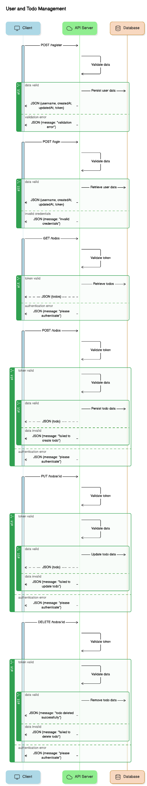
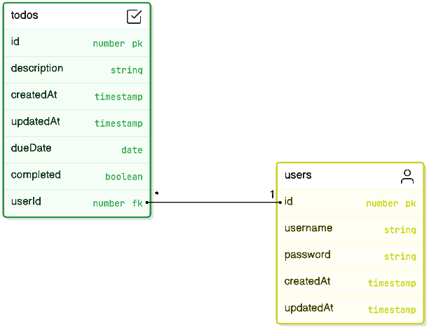

# Todo API Service

A RESTful API service for managing todos with user authentication, built with TypeScript, Express.js, and PostgreSQL.

## Architecture


## Project Structure

```
src/
├── entities/          # Database models/entities
│   ├── User.ts       # User entity
│   └── Todo.ts       # Todo entity
├── routes/           # API route handlers
│   ├── auth.ts       # Authentication routes
│   └── todo.ts       # Todo CRUD routes
├── middleware/       # Custom middleware
│   └── auth.ts       # Authentication middleware
├── data-source.ts    # Database configuration
└── index.ts         # Application entry point
```

## Technology Stack

- **Runtime**: Node.js
- **Language**: TypeScript
- **Framework**: Express.js
- **Database**: PostgreSQL
- **ORM**: TypeORM
- **Authentication**: JWT (JSON Web Tokens)

## Main Components

### 1. Database Layer

The application uses TypeORM with PostgreSQL for data persistence. Database configuration is managed in `data-source.ts` with support for environment variables:

- Host: `DB_HOST` (default: "db")
- Port: `DB_PORT` (default: "5432")
- Username: `DB_USER` (default: "postgres")
- Password: `DB_PASSWORD` (default: "postgres")
- Database: `DB_NAME` (default: "todos")

### 2. Entity Models

#### User Entity
- Stores user authentication data
- Has a one-to-many relationship with todos
- Properties:
  - id (Primary key)
  - username (string)
  - password (string)
  - createdAt (timestamp, auto-generated)
  - updatedAt (timestamp, auto-updated)

#### Todo Entity
- Properties:
  - id (Primary Key)
  - description (string)
  - createdAt (timestamp, auto-generated)
  - updatedAt (timestamp, auto-updated)
  - dueDate (optional)
  - completed (boolean, default: false)
  - user (Many-to-One relationship with User)

### ER Diagram


### 3. API Endpoints

#### Authentication Routes
- POST `/auth/register`: Register a new user
- POST `/auth/login`: Login and receive JWT token

#### Todo Routes
All todo routes require authentication via JWT token in the Authorization header.

- GET `/todos`: Get all todos for the authenticated user
- POST `/todos`: Create a new todo
  - Required fields: title
  - Optional fields: completed
  - Auto-generated: createdAt, updatedAt
- PUT `/todos/:id`: Update a todo by ID
  - Updatable fields: title, completed
  - Auto-updated: updatedAt
- DELETE `/todos/:id`: Delete a todo by ID

### 4. Swagger Documentation

The API is documented using Swagger/OpenAPI. Access the documentation at `/api-docs` when running the application.

## Getting Started

### Starting with pre-installed postgres
1. Clone the repository
2. Install dependencies:
   ```bash
   npm install
   ```

3. Set up environment variables in `.env`: (rename the .env-example to .env)
   ```env
   DB_HOST=localhost
   DB_PORT=5432
   DB_USER=postgres
   DB_PASSWORD=postgres
   DB_NAME=todos
   JWT_SECRET=your_jwt_secret
   ```

4. Run the migration
   ```bash
   npm run migration:run
   ``` 

5. Start the development server:
   ```bash
   npm run dev
   ```

6. Access the API:
   - API: http://localhost:3000
   - Swagger Documentation: http://localhost:3000/api-docs

### Starting with docker compose
1. Clone the repository
2. Install dependencies:
   ```bash
   npm install
   ```

3. Start the db from docker compose:
   ```bash
   docker compose up db -d
   ```

4. Run the migration:
   ```bash
   npm run migration:run
   ``` 

5. Start the development server:
   ```bash
   docker compose up --build
   ``` 

6. Access the API:
   - API: http://localhost:3000
   - Swagger Documentation: http://localhost:3000/api-docs


## Development Commands

- `npm run dev`: Start development server with hot-reload
- `npm run build`: Build the TypeScript code
- `npm start`: Start the production server
- `npm run typeorm`: Run TypeORM CLI commands
- `npm run migration:generate`: Generate a new migration
- `npm run migration:run`: Run pending migrations
- `npm run migration:revert`: Revert the last migration

## API Response Format

### Success Response
```json
{
  "id": 1,
  "title": "Sample Todo",
  "completed": false,
  "createdAt": "2023-11-14T10:30:00.000Z",
  "updatedAt": "2023-11-14T10:30:00.000Z",
  "dueDate": null
}
```

### Error Response
```json
{
  "error": "Error message",
  "details": "Detailed error information (if available)"
}
```

## Security

- Passwords are hashed using bcrypt before storage
- JWT tokens are used for authentication
- Protected routes require valid JWT tokens
- Environment variables are used for sensitive configuration

## Error Handling

The API returns appropriate HTTP status codes:
- 200: Success
- 201: Resource created
- 400: Bad request
- 401: Unauthorized
- 404: Resource not found
- 500: Server error

Each error response includes a descriptive message to help with debugging.
